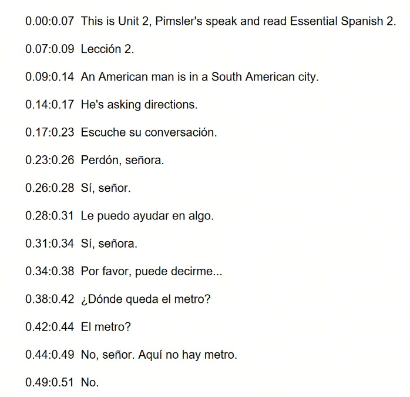

# Pimsleur Audio to PDF Transcriber

## Description

This project provides a Python script that automatically transcribes Pimsleur audio files into PDF documents with timestamps. It's a handy tool for language learners who want to review Pimsleur lessons in text format, with easy navigation between different sections.

## Key Features

    Transcribes Pimsleur MP3 audio files into text
    Includes accurate timestamps for each spoken segment
    Generates a well-formatted PDF document with clear text and timestamps
    Customizes the PDF output with page numbering and footers
    Estimates the number of pages needed based on text length
    Uses the openai-whisper library for transcription
    Generates PDFs using the FPDF library
## Dependencies

    openai-whisper
    fpdf
    setuptools-rust
    ffmpeg

Feel free to contribute to this project by:

    Reporting any issues or bugs
    Suggesting new features
    Submitting pull requests with improvements

## Sample 
It works well for Spanish, below is the output, i will try to test it for chinese and update the code 

